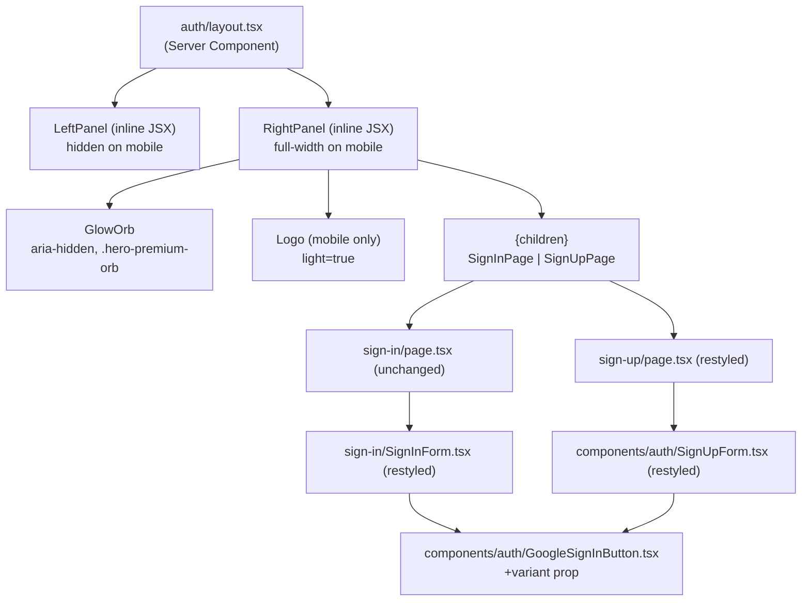
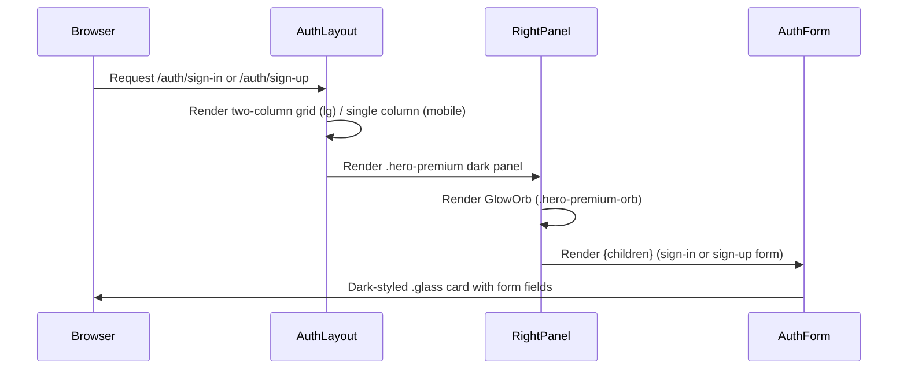

# Design Document: Auth Page Redesign

## Overview

Redesign CitePilot's sign-in and sign-up pages from a single-column centered card layout into a full-viewport two-panel split layout. The left panel (desktop only) carries brand/marketing content on a light `--color-cream` background. The right panel is a dark `--hero-bg` surface with a radial glow orb and the auth form rendered inside a `.glass` card. All server actions, auth hooks, and analytics calls remain completely untouched — this is a visual layer change only.

The implementation targets Next.js 16 (App Router) / React 19 / Tailwind CSS v4 (CSS-first, no `tailwind.config`). Styling relies exclusively on hand-authored utility classes in `globals.css` plus standard Tailwind utilities available in v4.

## Architecture



## Sequence Diagram — Page Render



## Components and Interfaces

### Component 1: `auth/layout.tsx` — AuthLayout

**Purpose**: Top-level shell that establishes the two-panel grid. Server component; no client-side state needed.

**Responsibilities**:
- Render a `min-h-[100dvh]` two-column grid (`grid-cols-2` at `lg:`, single column on mobile)
- Render `<LeftPanel>` (hidden below `lg:`)
- Render `<RightPanel>` that fills remaining space and contains `{children}`
- No longer renders the `Logo` at layout level on desktop (Logo moves into LeftPanel and into RightPanel for mobile)

**Interface** (no props beyond `children`):
```typescript
export default function AuthLayout({
  children,
}: {
  children: React.ReactNode
}): JSX.Element
```

**Left panel content** (inlined JSX, no separate file needed):
- `Logo` component (top-left)
- Headline `<h2>` "Cite smarter, not harder" — `font-display`, ≥`text-3xl`
- Three `ValuePropBullet` items (inline, no separate component needed)
- Back link `← Back to CitePilot` at bottom

**Right panel content**:
- `position: relative`, `overflow: hidden`
- `.hero-premium` background class
- `GlowOrb` element (`aria-hidden="true"`, `.hero-premium-orb .hero-premium-orb--cyan`)
- Mobile-only `Logo` (`light={true}`, `lg:hidden`)
- Centered `{children}` wrapper

---

### Component 2: `components/auth/GoogleSignInButton.tsx` — variant prop

**Purpose**: Add a `variant` prop (`"light" | "dark"`) so the button renders differently in the dark right panel. All existing auth logic is unchanged.

**Interface**:
```typescript
export function GoogleSignInButton({
  label,
  callbackPath,
  signupIntent,
  variant,
}: {
  label?: string;
  callbackPath?: string;
  signupIntent?: boolean;
  variant?: "light" | "dark";  // NEW — defaults to "light"
}): JSX.Element
```

**Behavior**:
- `variant="light"` (default): current `border-border bg-white text-ink` styling — fully backward compatible
- `variant="dark"`: `bg-[rgba(255,255,255,0.08)] border-[rgba(255,255,255,0.15)] text-white hover:bg-[rgba(255,255,255,0.14)]`

---

### Component 3: `sign-in/SignInForm.tsx` — restyled

**Purpose**: Replace the current light-mode card wrapper and input classes with dark equivalents. All `useActionState`, `useSearchParams`, and form `action` wiring stay identical.

**Changes**:
- Remove outer `rounded-2xl border border-border bg-white p-8 shadow-sm` wrapper div — the `.glass` card is now owned by this component
- Replace input classes with Dark_Input style
- Replace submit button `bg-ink` with `bg-[#10b981]` (mint)
- Pass `variant="dark"` to `GoogleSignInButton`
- Update divider line colors to `rgba(255,255,255,0.12)`

---

### Component 4: `sign-up/page.tsx` and `components/auth/SignUpForm.tsx` — restyled

**Purpose**: Parallel changes to sign-up. The page component currently owns the card wrapper; that wrapper moves into `SignUpForm` (consistent with how `SignInForm` owns its own card in this redesign).

**`sign-up/page.tsx` changes**: Remove the outer `rounded-2xl border … bg-white` card div; render only `<Suspense><SignUpForm /></Suspense>` (the heading and subtext move into `SignUpForm`).

**`SignUpForm.tsx` changes**: Mirror `SignInForm` — add `.glass` card wrapper, dark inputs, mint submit button, `variant="dark"` on `GoogleSignInButton`, updated divider colors.

---

## Data Models

No new data models. The redesign is purely presentational.

**Relevant existing CSS classes** (all from `globals.css`, used as-is):

| Class | Purpose |
|---|---|
| `.hero-premium` | Multi-layer dark radial gradient for Right_Panel background |
| `.hero-premium-orb` | Absolutely-positioned blur circle with `hero-glow-pulse` animation |
| `.hero-premium-orb--cyan` | Cyan variant of the orb, top-centered |
| `.glass` | `rgba(255,255,255,0.07)` bg + `backdrop-filter: blur(16px)` + subtle border — card surface |
| `.font-display` | Plus Jakarta Sans typeface |
| `.text-shimmer` | Animated shimmer gradient text (optional use on headline) |

**Dark_Input class string** (applied inline, no new CSS needed):
```
mt-2 w-full rounded-xl border border-[rgba(255,255,255,0.15)] bg-[rgba(255,255,255,0.06)]
px-4 py-3 text-sm text-white placeholder:text-white/50 outline-none
focus:border-[var(--color-accent)] focus:ring-2 focus:ring-[var(--color-accent)]/20
```

---

## Algorithmic Notes

The layout switch is CSS-only (Tailwind responsive prefix `lg:`). No JavaScript involved.

```
DESKTOP (lg: ≥1024px)
  grid grid-cols-2 min-h-[100dvh]
  ├── Left panel   (col 1) — bg-cream, flex col, p-12
  └── Right panel  (col 2) — hero-premium, relative, overflow-hidden, flex items-center justify-center

MOBILE (< 1024px)
  grid grid-cols-1 min-h-[100dvh]
  └── Right panel only — full viewport, flex col, gap between logo + form card
      Left panel: hidden (lg:block → not rendered visually; use `hidden lg:flex` on left panel)
```

Mobile logo placement in Right_Panel:
```
<div class="lg:hidden mb-8">
  <Logo light={true} />
</div>
```

---

## Error Handling

All error display logic is preserved unchanged:

- `state?.error` rendering in `SignInForm` and `SignUpForm` — same JSX, updated text color to `text-red-400` (better contrast on dark background vs current `text-red-600`)
- `oauthError` banner in `SignInForm` — update background to `bg-red-900/30 border-red-500/40 text-red-300` for dark panel contrast
- `GoogleSignInButton` internal error state — already renders below the button; text color updated to `text-red-400` in dark variant

---

## Testing Strategy

### Unit Testing Approach

Each component change is shallow and deterministic. Key unit test cases:

- `GoogleSignInButton` with no `variant` prop renders `bg-white` (backward compat)
- `GoogleSignInButton` with `variant="dark"` renders without `bg-white`
- `SignInForm` renders `h1` as first heading in DOM output
- `SignUpForm` renders all three input fields with correct `autoComplete` values

### Property-Based Testing Approach

Not applicable — this is a pure UI layout/styling change with no computational logic, no parsers, no data transformations, and no business rules that vary with input. Example-based and snapshot tests are the appropriate strategy here.

### Integration / Visual Testing Approach

- Render at 1440px viewport: Left panel visible, Right panel visible, no horizontal scroll
- Render at 768px viewport: Left panel absent from DOM, Right panel full-width, mobile logo visible
- Render at 375px viewport: Auth form card centered, max-w-[448px], 1rem horizontal padding
- Verify `GlowOrb` has `aria-hidden="true"` in rendered DOM
- Verify submit button has mint background, not `bg-ink`

---

## Security Considerations

- No auth logic is modified. The `signInWithEmail` and `signUpWithEmail` server actions at `src/app/auth/sign-in/actions.ts` and `src/app/auth/sign-up/actions.ts` are completely untouched.
- `GoogleSignInButton` continues to call `authClient.signIn.social` with identical parameters.
- The hidden `from` field in the sign-in form is unchanged.
- `autoComplete` attributes on all inputs are preserved to retain browser autofill and password manager support.

---

## Accessibility Considerations

- `GlowOrb` carries `aria-hidden="true"` — decorative, screen-reader-invisible
- Left panel icon SVGs carry `aria-hidden="true"`
- Back link text "← Back to CitePilot" is descriptive; no additional `aria-label` needed
- `h1` heading is the first heading in the Right_Panel DOM order
- All Dark_Input contrast: white text on `rgba(255,255,255,0.06)` background over `#04060c` → effective contrast passes WCAG AA (text is `#ffffff`, effective bg is approximately `#0f1117`)
- Label text at `white/70` (≈`#b3b3b3`) on dark background: contrast ~7.5:1 against `#04060c` — passes AA
- Mint submit button (`#10b981`) with white text: contrast ~3.8:1 — meets AA for large text (button text is 14px bold, qualifies as large text at 18.66px bold equivalent)
- Reduced-motion: `GlowOrb` animation pause already handled by existing `@media (prefers-reduced-motion: reduce)` rule in `globals.css`

---

## Dependencies

No new dependencies. All classes, tokens, and components already exist in the codebase:
- `globals.css` — `.hero-premium`, `.hero-premium-orb`, `.hero-premium-orb--cyan`, `.glass`, `hero-glow-pulse`
- `src/components/ui/Logo.tsx` — `light` prop already supported
- Tailwind CSS v4 — arbitrary value syntax `bg-[rgba(...)]`, `border-[rgba(...)]` available natively

---

## Correctness Properties

*A property is a characteristic or behavior that should hold true across all valid executions of a system — essentially, a formal statement about what the system should do.*

### Property 1: Dark variant backward compatibility

For any render of `GoogleSignInButton` without a `variant` prop (or with `variant="light"`), the rendered output shall not contain dark-surface background styles, preserving the existing light appearance for all current usages outside the auth redesign.

**Validates: Requirements 5.4**

### Property 2: Auth logic preservation — form action wiring

For any invocation of the sign-in or sign-up form submission, the `formAction` derived from `useActionState(signInWithEmail, null)` / `useActionState(signUpWithEmail, null)` shall be the function attached to the `<form action={...}>` attribute, regardless of any visual changes made to the surrounding elements.

**Validates: Requirements 7.1, 7.2, 7.3, 7.4**

### Property 3: Heading hierarchy

For any render of either auth page, the first `<h1>` element in the Right_Panel DOM subtree shall appear before any `<h2>` or lower headings within the same subtree, ensuring a logical heading order for screen readers.

**Validates: Requirements 9.1**

### Property 4: autoComplete preservation

For any render of `SignInForm` or `SignUpForm`, every `<input>` element shall carry the same `autoComplete` attribute value as in the pre-redesign implementation (`"email"`, `"current-password"`, `"new-password"`, `"name"`).

**Validates: Requirements 9.6**

### Property 5: Mobile panel exclusion

For any render at a viewport below the `lg:` breakpoint (1024px), the Left_Panel content (headline, value-prop bullets, back link) shall not be present in the accessible DOM — achieved via `hidden lg:flex` — so screen readers and keyboard navigation are not burdened by invisible marketing content.

**Validates: Requirements 1.2, 8.5**

**Validates: Requirements 1.2, 8.5**
